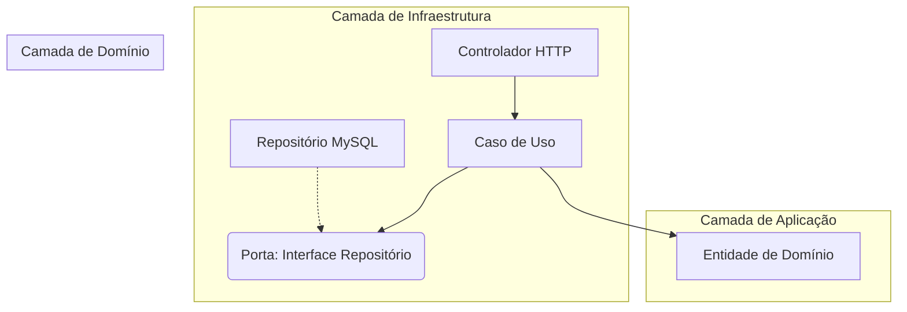

# Guia de Transição: Arquitetura Hexagonal (Ports and Adapters)

Este documento resume os aprendizados aplicados na API `hexa-trouw` e propõe como utilizá-los para unificar o ecossistema de projetos PHP (Web, API e Microsserviços).

---

## 1. Resumo dos Aprendizados (Resumo Teórico/Prático)

A Arquitetura Hexagonal foca em **isolar a lógica de negócio** (o Core) de periféricos como bancos de dados, interfaces web e APIs de terceiros.

### As Três Camadas do Hexágono:

1.  **Domínio (Domain)**:
    *   **O que é**: O coração do sistema. Contém Entidades, Objetos de Valor e Regras de Negócio fundamentais.
    *   **Regra de Ouro**: Não depende de NADA externo. Não sabe que o banco é MySQL ou que o framework é NestJS ou Laravel.
2.  **Aplicação (Application)**:
    *   **O que é**: Orquestra o fluxo. Contém os **Casos de Uso** (Use Cases).
    *   **Função**: Recebe um comando (ex: "Criar Viagem"), busca dados via uma Porta, executa a lógica e devolve o resultado.
3.  **Infraestrutura (Infrastructure)**:
    *   **O que é**: Implementa os **Adaptadores**.
    *   **Exemplos**: Repositórios (TypeORM/Eloquent), Controladores (HTTP), Clientes de API externa (Guzzle/Axios).

### Conceito de Ports and Adapters:
*   **Port (Interface)**: O contrato que o domínio define ("Eu preciso salvar uma Viagem").
*   **Adapter (Implementação)**: O código que executa a tarefa real ("Eu salvo no MySQL usando Eloquent").

---

## 2. Propostas de Aplicação Prática no Ecossistema Atual

O nosso ecossistema atual possui **Web PHP**, **API de Integração** e **Microsserviços**, cada um lidando com o banco de forma diferente.

### Estratégia de Migração: O Padrão "Estrangulamento" (Strangler Fig)
Não tente reescrever tudo de uma vez. Comece extraindo a lógica de negócio mais crítica.

1.  **Criação do Core Compartilhado**:
    *   Identifique regras de negócio que se repetem (ex: cálculo de frete, validação de nota fiscal).
    *   Implemente essas regras em uma biblioteca (ou módulo) seguindo a estrutura do `hexa-trouw` (Domain + Application).
2.  **Unificando o Banco de Dados (Repositórios)**:
    *   Defina **Ports** (Interfaces) para o banco de dados.
    *   Cada aplicação PHP (Web, API, MS) implementa seu próprio **Adapter** para essa interface, mas a lógica de como usar o dado fica no Use Case compartilhado.
3.  **Encapsulamento de Legado**:
    *   Para partes do sistema que ainda usam SQL puro ou métodos antigos, crie um "Adaptador Legado" que implementa a nova interface. Assim, o resto do código já começa a usar o padrão novo sem saber que o banco ainda é "bagunçado".

---

## 3. Sugestões de Boas Práticas e Padrões

*   **Casos de Uso "Atômicos"**: Cada funcionalidade deve ter um Use Case único (ex: `CreateTravelUseCase`). Isso facilita testes e manutenção.
*   **Anti-Corruption Layer (ACL)**: Ao ler dados de um banco legado ou API externa, converta-os imediatamente para suas **Entidades de Domínio**. Nunca deixe o "lixo" ou o formato do banco vazar para sua regra de negócio.
*   **Injeção de Dependência**: Use o container de injeção (do NestJS ou do Laravel/Symfony) para injetar Adapters nas Ports. O Use Case nunca deve dar um `new` em um Repositório.
*   **Fail Fast**: Validações básicas (campos obrigatórios, tipos) devem acontecer nos DTOs (na Infra). Validações de regra de negócio (ex: "não pode viajar sem motorista") devem ficar no Domínio.

---

## 4. Fluxo de Desenvolvimento (New Feature)

Para incorporar essas abordagens no dia a dia, siga este fluxo ao receber uma nova tarefa:

1.  **Definição (Domínio)**:
    *   Crie a Entidade e suas regras.
    *   Crie as **Ports** (Interfaces) necessárias (Repo de Banco, API de Clima, etc).
2.  **Orquestração (Aplicação)**:
    *   Crie o `UseCase`. Ele deve receber as Ports no construtor.
    *   Escreva a lógica do Use Case usando apenas os métodos das Ports.
3.  **Implementação (Infraestrutura)**:
    *   Crie os **Adapters** que implementam as Ports.
    *   Crie o **Controlador** (ou Comando CLI) que chama o Use Case.
4.  **Wiring (Módulo)**:
    *   Registre as dependências no container para que o sistema saiba qual Adaptador usar para cada Porta.

---

> [!TIP]
> **Próximo Passo Recomendado**: Escolha uma funcionalidade pequena que hoje está duplicada entre a Web PHP e a API de Integração e tente criar um pequeno "Core Hexagonal" para ela. Isso servirá como prova de conceito para o restante da equipe.
