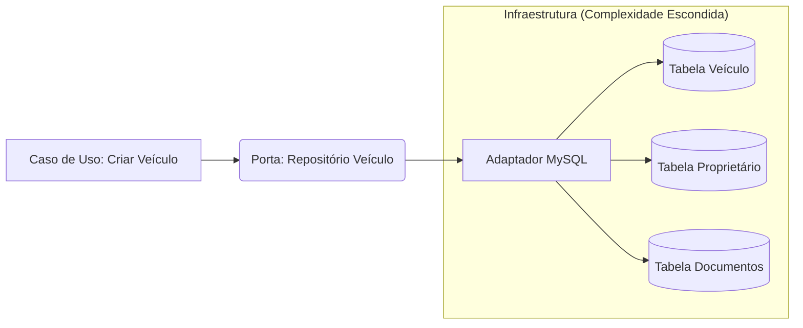

# Guia de Migração: Arquitetura Hexagonal e Cadastros Logísticos 🚚

Este documento serve como a única fonte de verdade para a estratégia de migração do ecossistema PHP para uma Arquitetura Hexagonal, com foco especial na complexidade dos cadastros (Veículos, Locais, Regiões, etc.).

---

## 1. Fundamentos da Arquitetura (O Core)

O objetivo principal é proteger a lógica de negócio (Domínio) de mudanças tecnológicas e da complexidade do banco de dados legado.

### Camadas:
- **Domínio (Domain)**: Onde vivem as regras e entidades (ex: `Vehicle`, `Location`). **Não depende de nada.**
- **Aplicação (Application)**: Onde vivem os **Casos de Uso** (ex: `RegisterVehicleUseCase`). Orquestra o fluxo.
- **Infraestrutura (Infrastructure)**: Onde vivem os **Adaptadores** (ex: o código que fala com o MySQL ou com uma API externa).

### Portas e Adaptadores:
- **Porta (Interface)**: O Domínio diz: "Eu preciso de um jeito de salvar um Veículo".
- **Adaptador (Implementação)**: A Infraestrutura diz: "Eu sei salvar no MySQL usando estas 4 tabelas legadas".

---

## 2. Estratégia de Migração: Strangler Fig (Estrangulamento)

Não reescrevemos o sistema todo. Começamos criando o **Core Hexagonal** para as novas funcionalidades e para partes críticas do sistema atual, "estrangulando" o software legado aos poucos.

---

## 3. Foco em Cadastros Complexos (Multi-tabelas) 🛠️

A maior dor identificada é que um único cadastro (como **Veículo**) gera registros em múltiplas tabelas, algumas das quais são compartilhadas com outros cadastros.

### Solução: Repositório como Fachada
No Domínio, o seu código deve ver apenas uma entidade `Vehicle` limpa. Toda a complexidade de mapeamento acontece dentro do **Adapter de Repositório**.

#### Exemplo: Entidade Veículo
Um Veículo pode envolver as tabelas `veic_veiculo`, `prop_proprietario` e `docu_documentos`.

1.  **Entidade de Domínio**: Uma classe simples `Vehicle` com todos os atributos necessários.
2.  **Repositório (Porta)**: `interface VehicleRepositoryPort { save(v: Vehicle): void; }`
3.  **Adaptador de Infraestrutura**: É aqui que a "mágica" acontece:
    - O adaptador recebe a Entidade `Vehicle`.
    - Ele inicia uma **Transação de Banco de Dados**.
    - Ele mapeia os dados para `veic_veiculo`, `prop_proprietario`, etc.
    - Ele garante que todos os registros sejam criados ou nenhum deles seja (Atomicidade).

### Tratamento de Tabelas Compartilhadas (Shared Kernel)
Se dois cadastros (ex: Veículo e Transportador) usam a mesma tabela comum (ex: `pess_pessoa` para dados básicos), aplicamos:

*   **Shared Value Objects**: Criamos objetos de valor comuns (ex: `Address`, `ContactInfo`) que são usados por ambas as entidades de domínio.
*   **Mapeamento Independente**: O adaptador de cada cadastro sabe como ler/escrever sua parte na tabela comum, garantindo que um módulo não quebre o outro.

---

## 4. Fluxo de Desenvolvimento Sugerido

Para incorporar essa abordagem, a equipe deve seguir estes passos ao migrar um cadastro:

1.  **Mapear as Tabelas**: Identificar todas as tabelas envolvidas no cadastro legado.
2.  **Definir a Entidade de Domínio**: Criar a classe que representa o modelo de negócio ideal, sem olhar pro banco inicialmente.
3.  **Criar o Mapper**: Desenvolver a lógica de conversão entre a Entidade e as tabelas reais.
4.  **Implementar o Adapter**: Criar o código de persistência usando transações para garantir consistência em todas as tabelas.

---

> [!IMPORTANT]
> **Consistência é a Chave**: Como você está manipulando tabelas que outros sistemas legados usam, **nunca** pule a camada de transação nos adaptadores. O Domínio deve confiar cegamente que o Adaptador cuidará da integridade dos dados.

> [!TIP]
> **Comece pelo mais Simples**: Se Regiões forem menos complexas que Veículos, use-as como o primeiro laboratório para esse novo modelo.
